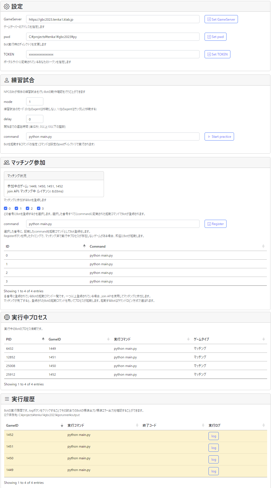
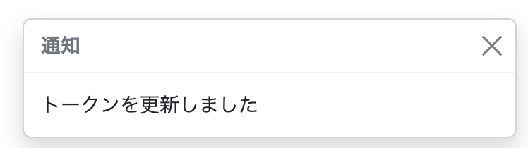
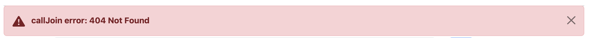

Runnerの使い方
======

## Runnerの概要
- Runnerはゲームへの参加とbotの起動を支援するプログラムです。
- Runnerにbotを登録すると、自動的に `join` APIを使用してマッチングに参加しゲーム開始時にbotを起動します。
- Runnerが実行したbotの標準出力はゲームごとにファイルに保存されます。
- Runner内の情報は自動で更新されます。

## Runnerの起動方法

### ビルド済バイナリを起動する
[リポジトリ内のgorunnerディレクトリ](/gorunner) にある gorunner バイナリを実行します。

### ビルドして実行する
[リポジトリ内のgorunnerディレクトリ](/gorunner) にある main.go がソースコードです。 `go run main.go` でビルドして実行することができます。

プログラム起動時に自動的にブラウザが立ち上がりRunnerの設定画面が表示されます。

### Windows Subsystem for Linux (WSL2) での利用
WSL2を使用してプログラムの開発および実行を行いたい場合は、Linux版のRunnerをWSL2上で実行します。  
Runnerの設定画面を開くには、お使いのPC上のWebブラウザを使用し、http://localhost:8080 にアクセスしてください。

### リモートマシン (Linux) での利用
AWS、GCP、VPSなどのリモート環境での開発および実行を行いたい場合は、Linux版のRunnerをリモートマシン上で実行します。  
Runnerの設定画面にアクセスするためには、お使いのPC上のWebブラウザを使用し http://<リモートマシンのIPアドレス>:8080 にアクセスしてください。  
※ PCからリモートマシンへのアクセスにTCPポート8080を使用できるように、ファイアウォールの設定を適切に行う必要がある場合があります。

Runnerの設定画面が表示されます。

## 設定
- GameServer: ゲームサーバーのアドレスを指定します。
- pwd: カレントディレクトリを変更します。
- TOKEN: ポータルサイトに記載されているあなたのトークンを指定します。

これらの設定は runner 起動時のカレントディレクトリの `config.toml` に保存されます。

## 練習試合
NPCのみが相手の練習試合を行いbotの動作確認を行うことができます。

- mode: 練習試合のモードを選択します。
- delay: 練習試合開始までの遅延時間を指定します。
- command: botを起動するコマンドを指定します。コマンドは設定のpwdディレクトリで実行されます。
    - Runnerから起動されたBotは速やかにmoveを行う必要があります。
    - ビルドと実行を同時に行う `go run` や `dotnet run` などのコマンドを指定すると、最初の数ターン行動できない場合があることに注意してください。

`[Start practice]` ボタンをクリックすると、指定したbotで練習試合を開始します。

## マッチング参加
マッチングに参加するBotを登録します。

最大4つのbotを登録することができます。使用されるbotはラウンドロビン方式で選ばれます。

1. チェックボックスでどの番号にbotを登録するかを選択します。
2. command にbotの起動コマンドを入力します。これは練習試合と同じものです。
    - Runnerから起動されたBotは速やかにmoveを行う必要があります。
    - ビルドと実行を同時に行う `go run` や `dotnet run` などのコマンドを指定すると、最初の数ターン行動できない場合があることに注意してください。
3. `[Register]` ボタンをクリックして指定botを登録します。

botが一つでも登録されている場合、Runnerは `join` APIを使用してマッチングに参加します。  
このとき、参加中のゲームIDの一覧と、`join` APIのレイテンシ情報が表示されるようになります。

botの登録を解除したい場合は、command を空文字にして `[Register]` をクリックします。

## Botに渡される環境変数
これらの値はBotプログラムから利用することができます。

- `GAME_SERVER`: GameServer で指定されている値が設定されます。
- `TOKEN`: TOKEN で指定されている値が設定されます。
- `GAME_ID`: 参加したゲームのゲームIDが設定されます。

## 実行中プロセス
練習試合、マッチングによる試合ともに、botが実行されると実行中のbotの情報が表示されます。

## 実行履歴
練習試合、マッチングによる試合ともに、botが実行されるとbotの標準出力/標準エラー出力がファイルに記録されます。

Botの実行が終了すると終了コードも表示されるので正常に終了していたかやエラーが出ていたかの参考にしてください。

また、背景の色は実行中は黄色、終了コードが0は緑、それ以外は赤で表示されます。

`[log]` ボタンをクリックすることで、botのログを閲覧することができます。ログファイル自体は、outputDir以下に保存されています。

## 通知

Runnerでトークンの設定などを行うとページ右下に下記の画像のような通知が表示されます。

また、一定期間後に通知は自動的に消えます。

## エラー通知

Runnerでエラーが発生した場合はページ上部に下記の画像の様なエラーが表示されます。

また、エラー通知は一定期間経っても自動で消えないため通知に表示されている閉じるボタンをクリックして閉じてください。

